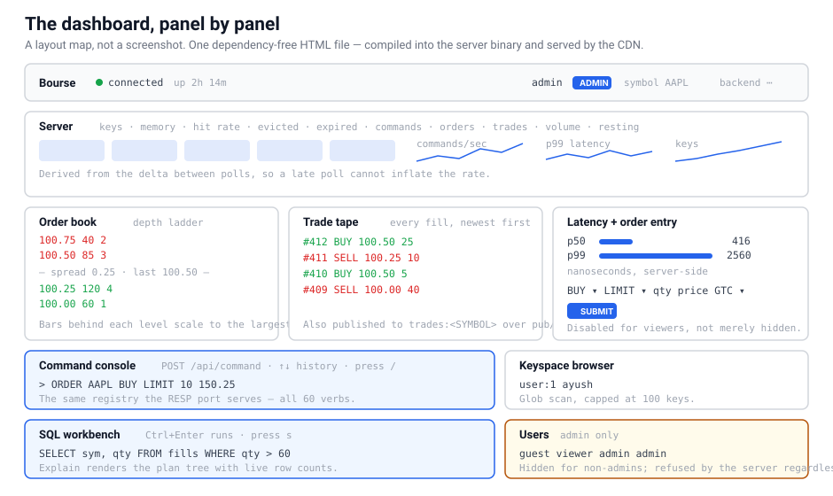
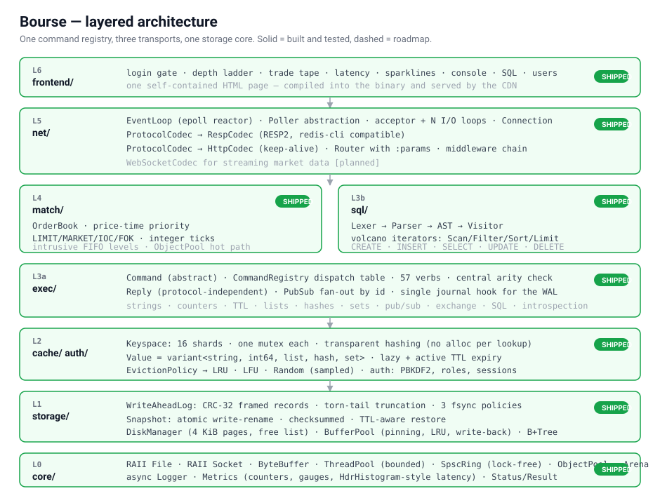
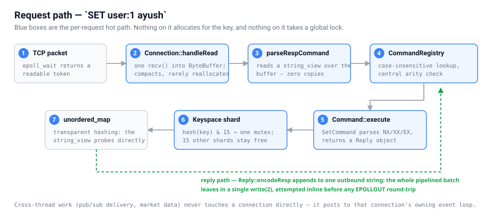

# Bourse

**A from-scratch trading exchange with its own storage engine, cache, and query layer.** Modern C++20, zero third-party runtime dependencies, a hand-written `epoll` reactor, and wire compatibility with `redis-cli`.

<p>
  <a href="https://bourse-mocha.vercel.app"></a>
  <a href="https://bourse-kn9j.onrender.com/health"></a>
</p>

<p>
  
  
  
  
  
  
  
</p>

---

## Try it

| | |
|---|---|
| **Dashboard** | **<https://bourse-mocha.vercel.app>** |
| **API** | **<https://bourse-kn9j.onrender.com>** |

Sign in read-only:

```
username:  guest
password:  explore-bourse-2026
```

> **First load takes ~50 seconds.** The backend runs on Render's free tier, which sleeps after 15 minutes idle. The dashboard will say "server unreachable" while it wakes — reload once and it comes up. Every load after that is instant.

`guest` is a **viewer**: it can read everything and write nothing. Try `SET k v` in the console and the server answers `NOPERM` — that refusal comes from the same permission check that guards the RESP port, which is the point of the whole auth layer.

**Once you are in, in about ninety seconds:**

1. **Command console** — `ORDER AAPL SELL LIMIT 10 100.50`, then `ORDER AAPL BUY LIMIT 4 101.00`. Watch the depth ladder and trade tape react. *(Read-only as `guest`; the demo server has live data from other visitors.)*
2. **SQL panel** — `SELECT * FROM fills` then hit **Explain** to see the query plan with live row counts.
3. **Keyspace** — scan `*` to browse what is in the store.
4. **Sparklines** — commands/sec, p99 latency and key count, all sampled from the server's own histogram.

Or skip the browser entirely:

```bash
curl https://bourse-kn9j.onrender.com/health
# {"status":"ok","uptime_ms":398491,"version":"1.0.0"}

curl -i https://bourse-kn9j.onrender.com/api/stats
# HTTP/1.1 401 Unauthorized
# WWW-Authenticate: Bearer realm="bourse"

curl -X POST https://bourse-kn9j.onrender.com/api/auth/login \
  -H 'Content-Type: application/json' \
  -d '{"username":"guest","password":"explore-bourse-2026"}'
# {"token":"…","username":"guest","role":"viewer","expires_at_ms":…}
```

<p align="center">
  
</p>

---

## What this is

A real exchange is not one system, it is five stacked on top of each other: a low-latency matching core, a durable journal, an in-memory state store, a query layer for historical data, and multi-protocol client access. Bourse builds that whole stack from scratch in one coherent codebase — no Boost, no libuv, no hiredis, no SQLite.

All five layers are built and tested. You can point `redis-cli` at it, `curl` at it, or open the dashboard in a browser, and all three reach the same command registry.

<p align="center">
  
</p>

---

## The 60-second demo

```bash
bash backend/scripts/build.sh
bash backend/scripts/demo.sh         # guided tour of every layer, then leaves the server up
```

Every script resolves its own location, so all of these work from the repository root.

Or start it yourself:

```bash
./backend/build/bin/bourse-server            # RESP on 6380, HTTP + dashboard on 8080
```

**It is a Redis server.** Stock `redis-cli`, nothing custom:

```console
$ redis-cli -p 6380
127.0.0.1:6380> SET user:1 ayush EX 300
OK
127.0.0.1:6380> INCRBY pageviews 99
(integer) 99
127.0.0.1:6380> RPUSH queue a b c
(integer) 3
127.0.0.1:6380> GET queue
(error) WRONGTYPE Operation against a key holding the wrong kind of value
```

**It is an exchange.** Price-time priority, real order types:

```console
127.0.0.1:6380> ORDER AAPL SELL LIMIT 10 100.50
1) "order_id"   2) (integer) 1
3) "status"     4) "NEW"
127.0.0.1:6380> ORDER AAPL BUY LIMIT 4 101.00
3) "status"     4) "FILLED"
11) "trades"    12) 1) 1) "sequence"  2) (integer) 1
                      3) "price"     4) "100.50"    <-- resting price, not 101
127.0.0.1:6380> BOOK AAPL
```

**It is a database.** Real lexer, parser, AST, and query plan:

```console
127.0.0.1:6380> SQL CREATE TABLE fills (id INTEGER PRIMARY KEY, sym TEXT, qty INTEGER)
OK
127.0.0.1:6380> SQL INSERT INTO fills VALUES (1, 'AAPL', 100), (2, 'MSFT', 50)
127.0.0.1:6380> SQL SELECT sym, qty * 2 AS doubled FROM fills WHERE qty > 60 ORDER BY qty DESC
127.0.0.1:6380> EXPLAIN SELECT * FROM fills WHERE qty > 60 LIMIT 1
"Limit(limit=1, offset=0)
   Filter((qty > 60), examined=1, passed=1)
     SeqScan(fills, rows=2)"
```

**It has an on-disk index.** A 4 KiB pager with a free list, a pinning buffer pool, and a B+ tree with node splits and range scans — 10,000 keys in a tree four levels deep, verified structurally after every mutation batch:

```cpp
BPlusTree tree(pool, disk);
tree.insert("AAPL:20260730:0930", record_id);
tree.scan("AAPL:20260730:0900", "AAPL:20260730:1000", visit);   // one descent, then a leaf walk
tree.validate();                                                 // sorted, balanced, correctly threaded
```

**It survives a crash.** `--appendonly yes` turns on the WAL:

```bash
./backend/build/bin/bourse-server --appendonly yes --dir ./data &
redis-cli -p 6380 SET survivor "still here"
kill -9 %1                                   # no clean shutdown, no flush
./backend/build/bin/bourse-server --appendonly yes --dir ./data &
redis-cli -p 6380 GET survivor               # "still here"
```

**It authenticates.** Off by default so a local run needs nothing; one flag turns it on, and the *same* role check then applies over RESP and over HTTP, because both go through one decision in the command registry:

```console
$ ./backend/build/bin/bourse-server --auth yes --admin-user admin --admin-password 'a-strong-one'
$ redis-cli -p 6380
127.0.0.1:6380> PING                       # pre-auth verbs still work
PONG
127.0.0.1:6380> GET anything
(error) NOAUTH Authentication required.
127.0.0.1:6380> AUTH admin a-strong-one
OK
127.0.0.1:6380> USER ADD reader a-reader-password viewer
OK
127.0.0.1:6380> AUTH reader a-reader-password
OK
127.0.0.1:6380> GET anything               # viewers read
(nil)
127.0.0.1:6380> SET k v                    # viewers do not write
(error) NOPERM this user has no permissions to run the 'SET' command
```

**It has two-factor authentication.** TOTP (RFC 6238), generated by this server — no third-party service, no extra dependency, works with Google Authenticator:

```console
$ curl -X POST $API/api/auth/2fa/begin -H "Authorization: Bearer $TOKEN"
{"secret":"JBSWY3DPEHPK3PXP","uri":"otpauth://totp/Bourse%3Aadmin?secret=..."}

$ curl -X POST $API/api/auth/login -d '{"username":"admin","password":"..."}'
{"error":"two-factor code required","code":"TOTP_REQUIRED"}   # a prompt, not a rejection
```

The implementation is checked against the vectors printed in the RFCs — FIPS 180-4 for SHA-1, RFC 2202 for HMAC-SHA1, RFC 4648 for Base32, **RFC 4226 Appendix D** for HOTP and **RFC 6238 Appendix B** for TOTP. A one-time-password implementation is either bit-for-bit compatible with what a phone generates or it is useless, and those tables are what decide which.

An accepted code's time step is recorded and anything at or below it is refused, so an observed code cannot be replayed inside its own 30-second window. Turning 2FA off requires the password, and re-enrolling while it is on is refused — otherwise `2fa/begin` would quietly replace the secret and switch enforcement off, giving a stolen session a way around the password check. Sessions can be listed and revoked individually, or "sign out other devices" while staying signed in here.

Passwords are PBKDF2-HMAC-SHA256 with a per-credential salt; session tokens are 256 bits of `/dev/urandom` and only their SHA-256 is stored. SHA-256, HMAC and PBKDF2 are implemented in this repo and **cross-checked against Python's `hashlib` over 850 randomised inputs** — see [docs/security.md](docs/security.md).

**It has a live dashboard.** Open <http://localhost:8080> — depth ladder, trade tape, latency histogram, live sparklines, command console with history, a SQL workbench, keyspace browser, and user administration. One self-contained HTML page compiled into the binary, and the same file Vercel serves.

---

## Status

| Layer | Component | State |
|---|---|:--|
| **L0** `core/` | RAII `File`/`Socket`, `ByteBuffer`, bounded `ThreadPool`, lock-free `SpscRing`, `ObjectPool`, `Arena`, async `Logger`, HDR-style `Histogram` | ✅ |
| **L1** `storage/` | `WriteAheadLog` with CRC-32 framing, torn-tail recovery, 3 fsync policies; atomic checksummed `Snapshot`; `DiskManager` + pinning `BufferPool` + on-disk `BPlusTree` | ✅ |
| **L2** `cache/` | 16-shard `Keyspace`, `Value` variant, lazy + active TTL expiry, sampled LRU/LFU/Random/NoEviction | ✅ |
| **L2b** `auth/` | SHA-1, SHA-256, HMAC and PBKDF2 from scratch, checked against the FIPS/RFC vectors and cross-checked against Python hashlib; salted password hashing, revocable hashed-token sessions, four ordered roles, login throttling, and **TOTP two-factor (RFC 6238)** with replay prevention | ✅ |
| **L3a** `exec/` | `Command` interface, dispatch registry, 60 verbs, protocol-independent `Reply`, `PubSub`, journal hook | ✅ |
| **L3b** `sql/` | Lexer → recursive-descent parser → AST → **Visitor** → volcano iterators | ✅ |
| **L4** `match/` | Order book, price-time priority, LIMIT/MARKET/IOC/FOK, amend, Observer market data | ✅ |
| **L5** `net/` | `Poller` (epoll + poll), `EventLoop`, acceptor + N reactors, `RespCodec`, `HttpCodec`, `Router`, middleware | ✅ |
| **L6** `frontend/` | Login gate with second-factor step, two-factor enrolment, active-session management, depth ladder, trade tape, latency histogram, live sparklines, command console with history, SQL workbench, keyspace browser, user administration | ✅ |
| — | Wiring the B+ tree in behind the SQL row store (the tree is built and tested; the executor still reads from memory) | 🚧 |
| — | WebSocket streaming (the dashboard polls once a second instead) | 🚧 |

---

## Quick start

### Prerequisites

Linux, or Windows with WSL2. One command provisions everything:

```bash
wsl -d Ubuntu --user root -- bash backend/scripts/setup-wsl.sh    # from Windows
sudo bash backend/scripts/setup-wsl.sh                            # on native Linux
```

Installs `g++`, `cmake`, `ninja`, `libgtest-dev`, `redis-tools` and `curl`.

### Opening it in an editor

The toolchain lives in WSL, so the folder must be opened **in WSL mode** — not
as a plain Windows folder. Otherwise the C++ extension finds no compiler and
every include shows a red squiggle.

```bash
code --remote wsl+Ubuntu /mnt/c/Users/ayush/Github/Bourse
```

Or from an already-open VS Code window: `Ctrl+Shift+P` → **WSL: Reopen Folder in WSL**.

The bottom-left corner should read `WSL: Ubuntu`. Once it does, `.vscode/` wires
up the rest:

| Shortcut | What it does |
|---|---|
| `Ctrl+Shift+B` | build |
| `Ctrl+Shift+P` → *Run Task* | test suite, smoke suites, sanitizers, benchmark, demo |
| `F5` | debug the tests or the server under gdb, with breakpoints |

IntelliSense reads `backend/build/compile_commands.json`, so it uses the real compiler
flags rather than guessing — run a build once and go-to-definition works
across the whole tree.

### Build, run, test

```bash
bash backend/scripts/build.sh                    # RelWithDebInfo + tests
./backend/build/bin/bourse-server                # start it
ctest --test-dir backend/build --output-on-failure
```

```
2026-07-30 09:14:02.118 [INFO ] command registry initialised with 60 verbs
2026-07-30 09:14:02.119 [INFO ] bourse-resp listening on 0.0.0.0:6380 (poller=epoll, io_threads=4)
2026-07-30 09:14:02.119 [INFO ] RESP endpoint ready on port 6380 -- try: redis-cli -p 6380 PING
2026-07-30 09:14:02.121 [INFO ] HTTP endpoint ready on port 8080 -- dashboard at http://localhost:8080/  (22 routes)
```

### Docker

```bash
docker compose up --build -d
redis-cli -p 6380 PING          # PONG
```

Two-stage build: no compiler in the runtime image, non-root user, ~80 MB.

### Options

```
--host <addr>              bind address                     (default 0.0.0.0)
--port <n>                 RESP port                        (default 6380)
--http-port <n>            HTTP/dashboard port              (default 8080)
--no-http                  disable the HTTP listener
--io-threads <n>           I/O event loops, 0 = auto        (default 0)
--shards <n>               keyspace shards, power of two    (default 16)
--maxmemory <size>         eviction budget, e.g. 256mb      (default unlimited)
--maxmemory-policy <name>  allkeys-lru | allkeys-lfu |
                           allkeys-random | noeviction      (default allkeys-lru)
--maxmemory-samples <n>    eviction sample size             (default 5)
--dir <path>               data directory                   (default ./bourse-data)
--appendonly <yes|no>      enable WAL + snapshot recovery   (default no)
--wal-sync <policy>        never | everysec | always        (default everysec)
--save-seconds <n>         snapshot interval, 0 disables    (default 300)
--log-level <level>        trace|debug|info|warn|error      (default info)
```

---

## Testing — how to verify everything, fast

Four independent layers of verification. One command runs them all:

```bash
bash backend/scripts/verify-all.sh
```

Or individually:

| What | Command | Result |
|---|---|---|
| Unit + integration | `./backend/build/bin/bourse_tests` | **290 tests, 52 suites** |
| KV over real `redis-cli` | `bash backend/scripts/smoke-test.sh` | **68 assertions** |
| HTTP + exchange | `bash backend/scripts/smoke-exchange.sh` | **42 assertions** |
| Crash recovery | `bash backend/scripts/smoke-persistence.sh` | **27 assertions** |
| Split deploy, CORS, `$PORT`, auth, SQL | `bash backend/scripts/smoke-deploy.sh` | **55 assertions** |
| Crypto vs. Python hashlib | `bash backend/scripts/verify-crypto.sh` | **850 digests** |
| ASan + UBSan + TSan | `bash backend/scripts/check-sanitizers.sh` | **clean** |
| Throughput + latency | `bash backend/scripts/benchmark.sh` | see below |

The tests are not decorative. A representative sample of what they pin down:

- **`RespParser.ReportsIncompleteForEveryProperPrefix`** and its HTTP twin — feed the parser *every* prefix of a valid request and require that it never claims success and never consumes a byte until the frame is whole. The classic "assumed one `read()` = one request" bug, tested exhaustively.
- **`ServerFixture.HandlesRequestsSplitAcrossPackets`** — the same property over a real TCP socket, one byte at a time.
- **`OrderBookTest.FillOrKillIsAllOrNothing`** — a FOK that cannot fill must leave the resting book *byte-for-byte untouched*, having emitted no trades.
- **`OrderBookTest.RepricingLosesTimePriority`** — an amended order must go to the back of a queue it never waited in.
- **`OrderBookTest.SteadyStateOrderEntryStopsAllocating`** — asserts the pool's chunk count stops moving after warm-up, which is the actual property the pool exists for.
- **`WriteAheadLog.TruncatesATornTailAndKeepsGoing`** — half a record from a crash is discarded, everything before it survives, and the log is writable again.
- **`SnapshotTest.RefusesToLoadADamagedImage`** — one flipped byte and recovery *refuses to start* rather than silently serving wrong data.
- **`SqlFixture.LimitStopsPullingRows`** — asserts via the plan's own counters that `LIMIT 5` over 500 rows examines exactly 5.
- **`BTreeFixture.InterleavedInsertAndEraseStayConsistent`** — 3000 randomised inserts and deletes, then a full structural `validate()`: sorted keys in every node, separators consistent with subtree contents, all leaves at equal depth, leaf chain correctly threaded. A subtly wrong B+ tree still answers most lookups correctly, so spot checks are not enough.
- **`BufferPoolTest.RefusesToEvictPinnedPages`** — the pool reports exhaustion rather than pulling a page out from under a caller holding it.
- **`SqlFixture.UpdateEvaluatesAgainstThePreUpdateRow`** — `SET a = b, b = a` must swap, not duplicate.
- **`Keyspace.ConcurrentIncrementsLoseNothing`** — 8 threads × 2000 increments must produce exactly the arithmetic total.
- **`RouterTest.MiddlewareCanShortCircuit`** — a middleware that does not call `next()` must stop the chain before the handler.
- **`ConfigEnvironmentTest.MalformedPortIsAnErrorRatherThanASilentFallback`** — a bad `$PORT` must stop the process. Falling back to the default would start a server the platform never routes to: healthy logs, every request timing out.
- **`AuthEnforcementTest.EveryRegisteredCommandHasADefensibleRequiredRole`** — walks all 60 verbs and fails if any reaches `anonymous` outside an explicit four-name allowlist. Adding a command that skips the permission check breaks the build rather than opening a hole nobody notices.
- **`AuthServiceTest.RejectsTheWrongPasswordAndUnknownUsersIdentically`** — the two error strings must be byte-equal, and a decoy hash makes the two paths cost the same. A distinguishable answer enumerates the user list from outside.
- **`AuthServiceTest.ChangingAPasswordRevokesLiveSessions`** and **`DeletingAUserRevokesLiveSessions`** — the reason people change a password is that someone else has it; leaving their session alive defeats the point.
- **`Sha256Test.HandlesTheLengthPaddingBoundaries`** — messages of 55, 56, 63, 64 and 65 bytes hit every padding branch. Getting this wrong yields a hash that is correct for *most* inputs, which is the worst failure mode available.
- **`JsonFieldTest.OnlyMatchesTopLevelKeys`** — `{"profile":{"password":"nested"},"password":"real"}` must read `real`. This parser handles credentials; a nested key shadowing the real one is how a value gets smuggled past validation.

---

## Benchmarks

**Machine:** 4-core WSL2 VM, GCC 15.2.0, `RelWithDebInfo`, 200k requests, 50 clients, stock `redis-benchmark`.

Client-side throughput across three runs of the **same binary on the same machine**:

| Workload | Run A | Run B | Run C |
|---|--:|--:|--:|
| `SET`, no pipelining | 42,992 | 21,064 | 19,614 |
| `GET`, no pipelining | 43,592 | 21,894 | 11,752 |
| `SET`, pipeline depth 16 | 501,253 | 208,117 | **1,342,282** |
| `GET`, pipeline depth 16 | 598,802 | 248,447 | **1,273,885** |

A 5× spread on identical code, so **no single figure there is worth quoting.** A 4-core WSL2 VM on a laptop, reached over emulated loopback, is not a measurement platform — one `GET` window in run C fell to 32 ops/s with a 2,993 ms average before recovering to 60,000.

The number that *is* stable is the server timing its own work, from the built-in HDR histogram over 1,000,005 commands:

| | Run A | Run B | Run C |
|---|--:|--:|--:|
| `command_latency_p50_ns` | 576 | 576 | **416** |
| `command_latency_p99_ns` | 2,304 | 3,328 | 2,560 |

**Sub-microsecond p50** for the full path: parse → registry lookup → arity check → permission check → shard lock → hash probe → mutate → encode. Tight across runs where the client-side numbers moved 5× — which is the expected shape, and the reason to trust it.

The unpipelined figures are **client-bound, not server-bound**: each client waits for a reply before sending again, so they measure loopback round-trip. The jump under pipelining is that round-trip being amortised away. Full discussion, including why authentication costs nothing per command, in [docs/benchmarks.md](docs/benchmarks.md).

---

## Design decisions worth defending

The comments in this codebase explain *why*, not *what*. A selection:

**Sixteen shards with a plain `std::mutex`, not a `std::shared_mutex`.** Reads are not read-only — every `GET` updates eviction metadata, so a `shared_lock` would be an outright data race. The alternatives were atomic metadata (cost on every access, still torn across two fields) or exclusive locking with enough shards that it stops mattering. → [`keyspace.hpp`](backend/include/bourse/cache/keyspace.hpp)

**Sampled eviction, not exact LRU.** Exact LRU needs an intrusive list touched on every read — turning every read into a write plus a pointer chase through cold memory. Bourse samples and ranks, which is why `--maxmemory-samples` exists. Random *bucket* probing keeps sampling O(1); `std::advance` from `begin()` would make eviction quadratic. → [`eviction.hpp`](backend/include/bourse/cache/eviction.hpp)

**A 64-bit token in the poller, not a pointer.** A pointer registered with the kernel outlives the C++ object if a connection dies between `epoll_wait` returning and dispatch — dereferencing it is a use-after-free. An integer id forces the dispatcher back through the connection table, where a stale token simply misses. → [`poller.hpp`](backend/include/bourse/net/poller.hpp)

**Commands return `Reply` objects, not bytes.** That one indirection is why RESP, REST and the dashboard cannot drift apart: there is one implementation behind all three, and the test suite inspects results structurally without parsing anything. → [`reply.hpp`](backend/include/bourse/exec/reply.hpp)

**Journalling lives in the registry, not in commands.** One hook after dispatch, gated on `Command::isWrite()`. A new write verb is persisted automatically and both transports are covered by construction. Journalling *after* execution and only on success matters too — logging first would persist commands that were then rejected. → [`command_registry.cpp`](backend/src/exec/command_registry.cpp)

**Prices are integer ticks.** `0.1 + 0.2 != 0.3` in binary floating point, so two orders that should cross at the same price compare unequal. There is a test for exactly that. → [`order.hpp`](backend/include/bourse/match/order.hpp)

**Trades print at the resting order's price.** Price improvement accrues to the side that was patient enough to sit on the book — the incentive every venue wants, and a classic thing to get backwards. → [`order_book.cpp`](backend/src/match/order_book.cpp)

**Fill-or-kill checks liquidity before consuming any.** A partial fill it then had to unwind would already have emitted trades that market-data consumers saw. → [`order_book.cpp`](backend/src/match/order_book.cpp)

**Visitor over the SQL AST.** The node set is closed and stable; the *operations* keep growing — evaluate, print for EXPLAIN, collect referenced columns, type-check. Virtual methods on every node would mean editing four classes per operation. There are two visitors in the tree already, and adding the second required changing no node. → [`ast.hpp`](backend/include/bourse/sql/ast.hpp)

**A volcano-model executor.** Uniform `open`/`next`/`close` means `LIMIT 10` over a million rows stops the scan after ten without any operator knowing about any other. The cost is a virtual call per row per operator — which is exactly why real engines moved to vectorised execution, and worth being able to say out loud. → [`engine.hpp`](backend/include/bourse/sql/engine.hpp)

**NULL is a distinct alternative, not a sentinel.** SQL's three-valued logic is not expressible in-band: `NULL = NULL` is NULL, and `WHERE x = NULL` matches nothing. Making it a type forces every comparison site to decide. → [`ast.cpp`](backend/src/sql/ast.cpp)

**A B+ tree, not a hash index.** A hash index answers point lookups in O(1) and range scans not at all. `WHERE ts BETWEEN a AND b`, `ORDER BY price` and "the next 50 rows" are all range queries, and they are most of what a trading system asks. Values live only in leaves so internal nodes fan out ~62 ways — a test asserts 10,000 keys produce a tree at most 4 levels deep. Leaves are singly linked so a range scan never walks back up. → [`bplus_tree.hpp`](backend/include/bourse/storage/bplus_tree.hpp)

**Pinning is what makes the buffer pool safe.** Eviction only ever considers unpinned frames; if all are pinned the pool reports exhaustion rather than pulling a page from under a caller. Forgetting to unpin therefore leaks a frame instead of causing a use-after-free — the failure mode you want. A `PageGuard` makes every early return in the tree code safe. → [`buffer_pool.hpp`](backend/include/bourse/storage/buffer_pool.hpp)

**CRC-32 on every WAL record.** Not paranoia — it is the only way to tell a torn tail from a crash (truncate, carry on) from corruption mid-file (refuse to start). Without it, replay would feed half a command into the keyspace. → [`wal.cpp`](backend/src/storage/wal.cpp)

**Snapshots are written to a temp file and renamed.** A crash mid-write leaves the previous good snapshot or a stray `.tmp` — never a truncated image that `load()` would accept as complete. → [`snapshot.cpp`](backend/src/storage/snapshot.cpp)

**Cache-line separation in the SPSC ring.** Producer writes `write_`, consumer writes `read_`; sharing a line means every push invalidates the consumer's copy. Each side also caches the *other* cursor so in steady state it never touches the other's line. → [`spsc_ring.hpp`](backend/include/bourse/core/spsc_ring.hpp)

**Inline writes before buffering.** `Connection::send` tries the socket first; buffering and waiting for `EPOLLOUT` would add a full loop iteration to every reply. → [`connection.cpp`](backend/src/net/connection.cpp)

### Bugs the tests actually caught

1. **Inline commands need bare `\n`.** The first RESP parser demanded `\r\n`. Stricter, and wrong — `redis-cli --pipe`, shell heredocs and `netcat` all send LF only, and they hung. Caught because the smoke test drives a *real* client. → `test_resp.cpp::ParsesInlineCommandWithBareLf`
2. **`NOT` bound too tightly in SQL.** Parsed as an ordinary prefix operator, `NOT symbol = 'AAPL'` became `(NOT symbol) = 'AAPL'` and returned zero rows instead of two — wrong answers, no error. SQL precedence is `OR < AND < NOT < comparison`. → `test_sql.cpp::NotBindsLooserThanComparison`
3. **A double unpin in B+ tree deletion.** When the root leaf emptied, an explicit `unpin` ran after the `PageGuard` had already released the frame. The pool rejected it loudly instead of silently corrupting the pin count — which is exactly why `unpin` validates. → `test_btree.cpp::ErasingEverythingLeavesAUsableTree`
4. **A data race in eviction.** `enforceMemoryBudget` compared `shard.memory_bytes` across shards without holding their locks. The fix copies each size out under its own lock.
5. **`std::thread::get_id()` after `join()`** returns the default id, not the thread's — a test failed for entirely the wrong reason.

---

## Request path

<p align="center">
  
</p>

---

## Commands (60)

| Group | Commands |
|---|---|
| **Strings** | `SET` (`EX`/`PX`/`NX`/`XX`), `GET`, `SETEX`, `APPEND`, `STRLEN` |
| **Counters** | `INCR`, `DECR`, `INCRBY`, `DECRBY` |
| **Generic** | `DEL`, `EXISTS`, `TYPE`, `KEYS` |
| **Expiry** | `EXPIRE`, `PEXPIRE`, `TTL`, `PTTL`, `PERSIST` |
| **Lists** | `LPUSH`, `RPUSH`, `LPOP`, `RPOP`, `LLEN`, `LRANGE` |
| **Hashes** | `HSET`, `HGET`, `HGETALL`, `HDEL`, `HLEN` |
| **Sets** | `SADD`, `SREM`, `SISMEMBER`, `SMEMBERS`, `SCARD` |
| **Pub/Sub** | `SUBSCRIBE`, `UNSUBSCRIBE`, `PUBLISH`, `PUBSUB` |
| **Exchange** | `ORDER`, `CANCEL`, `AMEND`, `BOOK`, `TRADES`, `SYMBOLS`, `EXCHANGE` |
| **SQL** | `SQL`, `EXPLAIN`, `TABLES`, `DESCRIBE` |
| **Server** | `PING`, `ECHO`, `INFO`, `DBSIZE`, `FLUSHALL`, `COMMAND`, `CONFIG`, `QUIT` |
| **Auth** | `AUTH`, `WHOAMI`, `USER` (`LIST`/`ADD`/`PASSWD`/`ROLE`/`DEL`) |

Every execution is republished to `trades:<SYMBOL>`, so `SUBSCRIBE trades:AAPL` in one terminal shows fills produced by orders typed into another.

## HTTP endpoints (22)

| Method | Path | Purpose |
|---|---|---|
| `GET` | `/` | dashboard (embedded in the binary) |
| `GET` | `/health` | liveness + uptime |
| `GET` | `/metrics` | Prometheus exposition format |
| `GET` | `/api/stats` | keyspace, engine and latency percentiles |
| `GET`/`PUT`/`DELETE` | `/api/keys/:key` | key CRUD |
| `GET` | `/api/keys?pattern=` | glob scan |
| `POST` | `/api/command` | run any verb, JSON reply |
| `POST` | `/api/sql` | run SQL, JSON result set |
| `GET` | `/api/tables` | table list |
| `GET` | `/api/book/:symbol` | depth snapshot |
| `GET` | `/api/trades/:symbol` | recent tape |
| `GET` | `/api/symbols` | traded symbols |
| `POST` | `/api/orders` | submit an order |
| `DELETE` | `/api/orders/:symbol/:id` | cancel |
| `POST` | `/api/auth/login` | exchange credentials for a session token |
| `POST` | `/api/auth/logout` | revoke the presented token |
| `GET` | `/api/auth/me` | current identity and role |
| `GET`/`POST` | `/api/auth/users` | list / create users (admin) |
| `DELETE` | `/api/auth/users/:username` | remove a user (admin) |
| `POST` | `/api/auth/2fa/begin` | start TOTP enrolment, returns secret + URI |
| `POST` | `/api/auth/2fa/confirm` | finish enrolment with a working code |
| `POST` | `/api/auth/2fa/disable` | turn it off (requires the password) |
| `GET` | `/api/auth/sessions` | this account's live sessions |
| `DELETE` | `/api/auth/sessions/:id` | revoke one |
| `POST` | `/api/auth/sessions/revoke-others` | sign out other devices |

---

## Project layout

```
Bourse/
├── frontend/                    everything the browser gets
│   ├── index.html               the entire dashboard -- no framework, no build
│   │                            step, no CDN. Also embedded into the binary.
│   ├── build.sh                 stamps the backend URL in for static hosting
│   └── vercel.json              Vercel config (Root Directory = frontend/)
│
├── backend/                     everything the server is
│   ├── CMakeLists.txt
│   ├── Dockerfile               multi-stage, non-root; build from the repo root
│   ├── include/bourse/          core, storage, cache, auth, exec, sql, match,
│   │                            net, server
│   ├── src/                     implementations, mirroring include/
│   ├── apps/bourse_server/      the executable
│   ├── apps/crypto_check/       CLI used to diff the crypto against hashlib
│   ├── tests/                   14 GoogleTest files, 320 tests
│   ├── cmake/                   warnings, sanitizers, asset embedding
│   └── scripts/
│       ├── setup-wsl.sh         one-shot toolchain provisioning
│       ├── build.sh             configure + build
│       ├── demo.sh              guided tour of every layer
│       ├── verify-all.sh        every check, one command
│       ├── smoke-test.sh        KV over real redis-cli
│       ├── smoke-exchange.sh    HTTP + matching engine
│       ├── smoke-persistence.sh SIGKILL and recover
│       ├── smoke-deploy.sh      cross-origin split + auth, both protocols
│       ├── verify-crypto.sh     crypto vs. Python hashlib
│       ├── check-sanitizers.sh  ASan+UBSan and TSan
│       └── benchmark.sh         redis-benchmark + server histogram
│
├── docs/                        architecture, benchmarks, deployment, security
├── .github/workflows/ci.yml     matrix, sanitizers, tidy, Docker
├── render.yaml                  backend deploy; Render only reads it at the root
└── docker-compose.yml
```

---

## Roadmap

- [x] **v0.1** Redis-compatible server — epoll reactor, RESP2, TTL, eviction, pub/sub
- [x] **v0.2** HTTP — codec, router, middleware chain, `/metrics`, REST API, dashboard
- [x] **v0.3** Durability — WAL with CRC framing and torn-tail recovery, atomic snapshots
- [x] **v0.4** SQL — lexer, parser, AST, Visitor, volcano executor
- [x] **v1.0** Exchange — order book, price-time priority, LIMIT/MARKET/IOC/FOK, market data
- [x] **v1.1** On-disk B+ tree — 4 KiB pager with a free list, pinning buffer pool, node splits, range scans
- [ ] **v1.2** Wire the B+ tree in behind the SQL row store, so tables live on disk
- [ ] **v1.3** WebSocket streaming so the dashboard pushes instead of polling
- [ ] **v1.4** Replication and consistent-hash sharding

---

## Deploying

**Deployed and live** — [dashboard](https://bourse-mocha.vercel.app) · [API](https://bourse-kn9j.onrender.com/health). Full walkthrough: **[docs/deployment.md](docs/deployment.md)**.

The deployment is split, because Vercel cannot host this server and no amount of configuration changes that. Vercel runs serverless functions scoped to a single request; Bourse is a resident multi-threaded `epoll` reactor that holds TCP connections open and keeps the keyspace, order books and buffer pool in process memory. A cache that forgets everything between requests is not a cache.

```
Browser ──HTTPS──► Vercel (dashboard, static, CDN) ──fetch/CORS──► Render (bourse-server in Docker)
```

| Half | Host | Why |
|---|---|---|
| Dashboard | **Vercel** | One dependency-free HTML file. `frontend/build.sh` stamps the backend URL into a copy of the *same* file the binary embeds, so there is no second copy to keep in sync. |
| Server | **Render** (free, Docker) | Builds `backend/Dockerfile` from the repo root. Reads `$PORT`, so the image deploys unchanged to Railway, Cloud Run or Fly.io too. |

```bash
bash backend/scripts/smoke-deploy.sh   # proves the split works before you deploy it
```

That starts the server, builds the static bundle, serves it from a *different* origin and asserts the whole path — `$PORT` handling, CORS pre-flight, cross-origin `GET`/`POST`, the injected URL, and that the embedded copy still defaults to same-origin. Then it starts a *second* server with authentication on and checks the login flow, role enforcement and revocation over both HTTP and `redis-cli`, and SQL over HTTP including the query plan. 55 assertions.

In a browser every one of those failures looks identical: a blank page and a console message nobody opens.

### What is actually running

| | |
|---|---|
| Frontend | Vercel, `frontend/` as the project root, `BOURSE_API_BASE` stamped in at build time |
| Backend | Render free tier, Singapore, `backend/Dockerfile` built from the repository root |
| Auth | On. Admin from `$BOURSE_ADMIN_PASSWORD`, read-only `guest` from `$BOURSE_DEMO_PASSWORD` |
| Persistence | WAL + snapshots to the container filesystem |
| Redeploys | Automatic on every push to `main`, both halves |

Both platforms watch `main`, so shipping a change is `git push` and nothing else. The one exception is `BOURSE_API_BASE`: it is baked into the HTML at build time rather than read at run time, so changing it needs a manual **Redeploy** on Vercel.

### What the free tier costs

**Render sleeps after 15 minutes idle**, and the next request takes ~50 s to wake it. That is why the demo section says so up front — a link that looks broken for a minute is worse than a link that warns you.

**No persistent disk.** The WAL and snapshots live in the container filesystem, so recovery genuinely works across a process restart but not across the instance being replaced. A mounted disk at `/home/bourse/data` on a paid plan makes it durable with no code change.

**Only the HTTP port is public**, so `redis-cli` cannot reach the deployed instance — Render publishes one port per web service. Every command is still reachable through `POST /api/command`. Fly.io can expose RESP on 6380 if that matters; the config is in the deployment guide.

### Adding real screenshots

The diagram above is a layout map, not a capture. To put real screenshots in:

```bash
# 1. Open the dashboard, press Ctrl+Shift+S (Firefox) or use
#    DevTools → Ctrl+Shift+P → "Capture full size screenshot" (Chrome/Edge)
# 2. Save into docs/img/ as dashboard-live.png and login.png
# 3. Reference them:
#      
```

Keep them under ~400 KB each — GitHub renders the README on every visit, and a multi-megabyte PNG is the slowest thing on the page.

---

## Building elsewhere

`Poller` has two implementations: `epoll` on Linux, portable `poll` everywhere else. Windows compiles via the Winsock paths, but Linux is the tested target — `perf`, `valgrind` and `redis-benchmark` all live there.

```bash
bash backend/scripts/syntax-check.sh          # type-check every TU without linking
bash backend/scripts/build.sh Debug address   # + AddressSanitizer
bash backend/scripts/build.sh Debug thread    # + ThreadSanitizer
```

---

## License

MIT — see [LICENSE](LICENSE).
